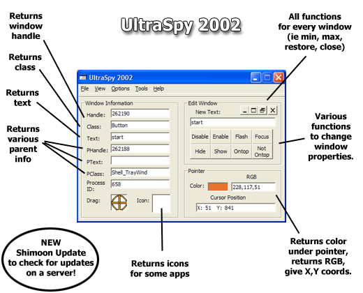



## UltraSpy 2002 Build 01

### Description

Windows XP compatible API spy! This is no average API spy - it has everything. It even comes with an update feature, which will check, download and install updates. Please vote if you like it! Thank you.
 
### More Info
 

             |
---                |---
**Submitted On**   |2001-11-13 22:58:08
**By**             |[Armen Shimoon](https://github.com/Planet-Source-Code/PSCIndex/blob/master/ByAuthor/armen-shimoon.md)
**Level**          |Intermediate
**User Rating**    |3.7 (22 globes from 6 users)
**Compatibility**  |VB 6\.0
**Category**       |[Windows API Call/ Explanation](https://github.com/Planet-Source-Code/PSCIndex/blob/master/ByCategory/windows-api-call-explanation__1-39.md)
**World**          |[Visual Basic](https://github.com/Planet-Source-Code/PSCIndex/blob/master/ByWorld/visual-basic.md)
**Archive File**   |[UltraSpy\_23516811142001\.zip](https://github.com/Planet-Source-Code/armen-shimoon-ultraspy-2002-build-01__1-28891/archive/master.zip)

